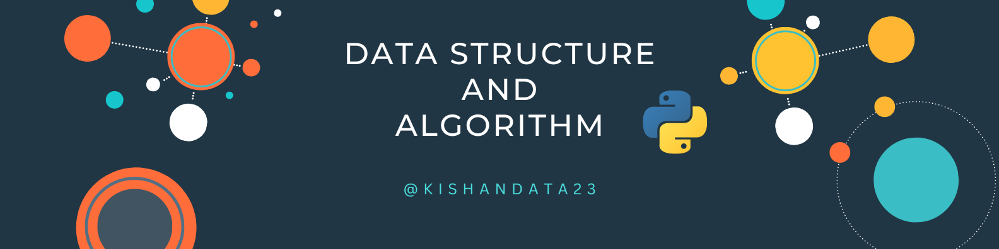

# <a href="../">🏠 Home</a>

## This page contains resources/Path to Learn DSA 

<!-- This Repo does not contains any Notes -->
<!-- Only Map or path and the problem solved -->
<h1 align="center">
  
   
  Complete DSA  
</h1>

Note:- 
- Make sure you have understanding of Python programing.
- Understand the concept of DS, later you can able to solve the problem with Python or any other Programming Language you 💖

## Topics to Learn in DS

- [Roadmap](https://whimsical.com/dsa-W5SUsw6VKVWXYuoeJZSnGU)
- Big O
- List
- Recursion
- Linked List
- Circular Linked List
- Doubly Linked List
- Stack
- Queue
- Binary Search Tree
- Hashing
- AVL Tree
- Heap
- Sorting

------
Youtube Playlist
- [Code basics Hindi](https://www.youtube.com/playlist?list=PLPbgcxheSpE3NlJ30EDpxNYU6P2Jylns8)
- [codebasics](https://www.youtube.com/playlist?list=PLeo1K3hjS3uu_n_a__MI_KktGTLYopZ12)
-
Blog
- [geekforgeek](https://www.geeksforgeeks.org/learn-data-structures-and-algorithms-dsa-tutorial)
------

-------------------------------
Note:-
- I will be using free resources available on internet or any other platform in this page