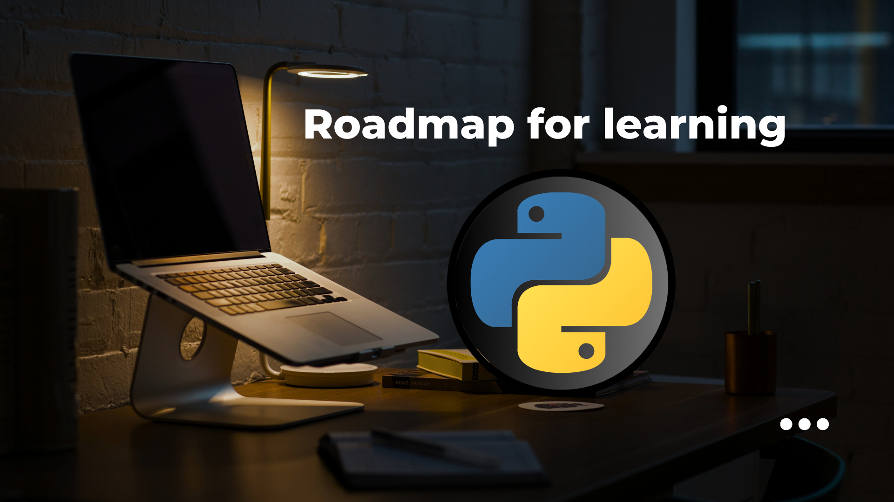

<!-- # <a href="../">🏠 Home</a>

## This page contains Roadmap 

<a href="https://whimsical.com/python-GkY4hVtFpnY75KRNXPCYhT">     Python   </a>  

 

 

 -->

# <a href="../">🏠 Home</a>

## Roadmap for Learning Data Science

### ⚒️⚒️ work under progress ⚒️⚒️

- [Roadmap](https://whimsical.com/data-science-BYBgVDUQ5364qwNZtrpTcX)

----

Note:-
- This page contains just overview and i will be updating and upgrading the information/plan present here over time.