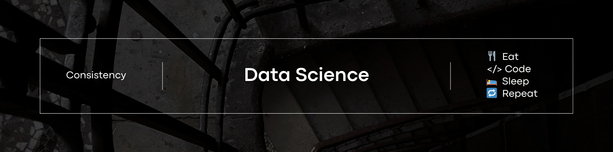

<h1 align="center">
  
   
  <!-- Data Science  -->
</h1>

### 📖 This Repo contains all the Notes and other resources need to start the Data Science Journey

-----------------------------------
### 👇 Check below 

<a href="./Resources/" target="_blank">🚏 Resources</a> | <a href="./Notes/">📒 Notes</a> | <a href="./Roadmap/">🗺️ Roadmap</a>  
---------------------------------------

### Topics 

- Maths for Data Science
- Python
- Flask or Django
- SQL
- Linux
- Git
- Statistics
- EDA & Feature Engineering
- ML
- DL
- Open CV
- Any 1 Cloud Tech. (AWS / AZURE / GCP)
- Projects
- Projects
- Projects
- Lots of Projects (try to choose Domain and do projects)

Learn topic and do projects

---------------

Note:- 
- Before starting learning for Data Science i have the knowledge of Basic of Python and SQL (solved 67 Leetcode problems) so time taken by me any you will be vary.
- I will be using free resources available on internet or any other platform in this page
- This page contains just overview and i will be updating and upgrading the information/plan present here over time.